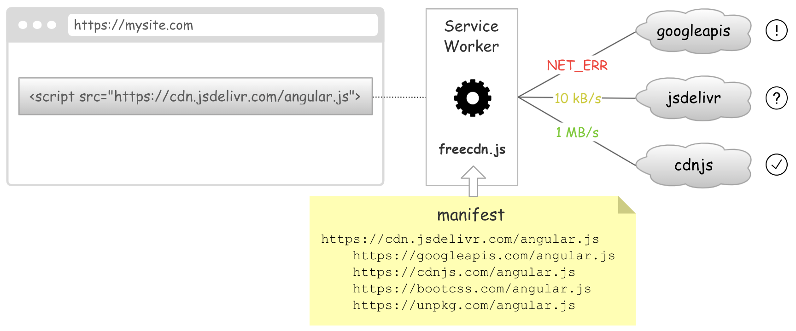
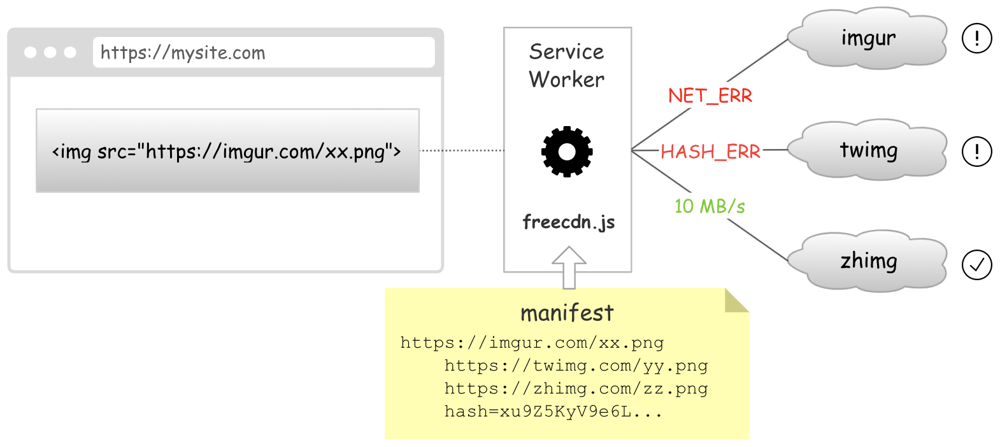
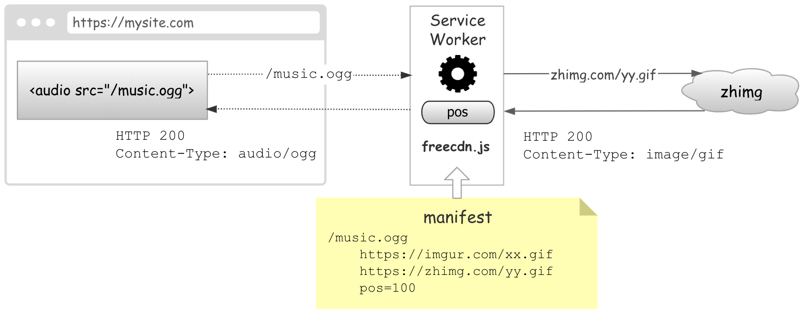
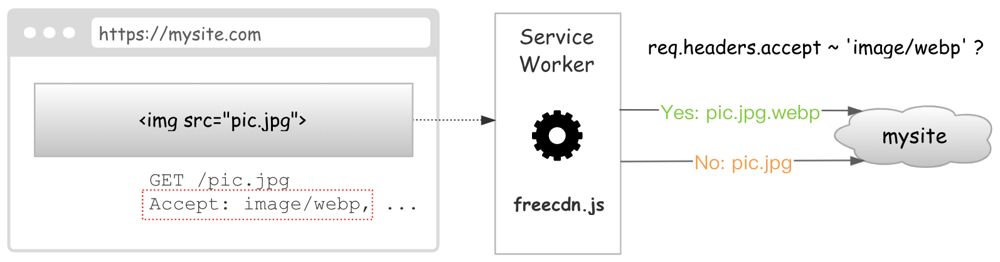
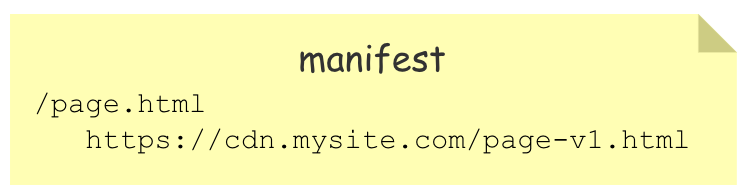
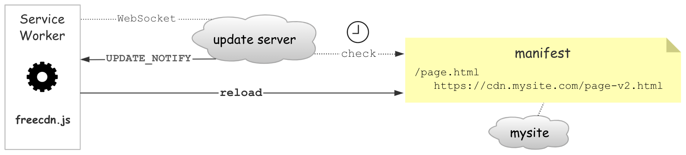

# 自动选择公共库

互联网上有很多免费的公共库 CDN，例如 `cdnjs`、`jsdelivr`、`unpkg`，但哪个最稳定，始终没有明确的答案。

有些国外的 CDN 虽然有大公司支持，但在国内无法确保网络稳定性；有些国内的 CDN 虽然网络稳定，但无法确保未来是否仍在维护。

这些 CDN 一旦出现问题，轻则网站打开变慢，重则功能损坏，经济损失甚至超过节省的费用。因此，不少人认为免费的才是最贵的，最终选择自己购买 CDN。

任何一个东西，既要有超低成本，又要有超高稳定性，显然是很难做到的。但是，既然成本很低，那不妨多准备几个，组成可容错的冗余系统，这样整体稳定性就变高了。

假设单个免费 CDN 的稳定性只有 `90%`，但事先准备 10 个，这时整体稳定性可达 `99.99999999%`。

如何实现这样的冗余系统？这就是 freecdn 要做的事！

## 原理

freecdn 的原理并不复杂，其核心使用了 HTML5 中一个重要的 API —— Service Worker。它是一种浏览器后台服务，能拦截当前站点产生的 HTTP 请求，并能控制返回结果，相当于给网站加了一层反向代理。有了这个黑科技，我们可以把传统 CDN 的功能搬到前端，例如负载均衡、故障切换等，通过 JS 灵活处理各种请求。

同时，网站开发者提供一个清单，记录用到的公共库以及备用 URL。

当 Service Worker 加载公共库出现问题时，可以不返回错误给上层页面，而是继续加载备用 URL，直到获得正确结果才返回。

因此，只要有一个备用节点正常，资源就不会加载失败。稳定性大幅提高。

甚至，你可以选择 [更激进的加载策略](../../examples/cdn-fallback/README.md#并行尝试) —— 同时加载多个备用 URL，哪个先完成就用哪个，实现带宽换时间的效果！

对于常见的公共库，你无需自己收集备用 URL，通过工具可自动生成清单。

# 全站 Hash 校验

现代浏览器可通过 [SRI](https://developer.mozilla.org/en-US/docs/Web/Security/Subresource_Integrity) 校验资源完整性，降低第三方站点的风险。但 SRI 也存在一些不足，例如支持的类型太少、需要修改 HTML、缺少备用机制。

SRI 目前支持的标签只有 `<script>`、`<link>`，不支持图片等其他资源。你可能认为图片被篡改不会有什么安全问题，但安全是很广泛的，并不局限于技术方面，内容安全也很重要。

例如第三方站点的图片，其控制权并不在你手中，理论上内容随时可以改变，轻则植入广告，重则出现非法内容，导致你的网站受到牵连。攻击者甚至可针对不同的用户显示不同的内容，管理员看到的总是正常内容，从而长时间被蒙在鼓里。

除了图片，视频、音频等资源同样存在类似问题，甚至纯文本都可能存在风险 —— 如果这些文字会显示在网页上，说不定哪天 CDN 被入侵后这些文字变成了反动宣传。因此从第三方站点加载的资源，无论什么类型，都应进行完整性校验，以确保内容安全。

虽然 SRI 无法校验所有类型的资源，但 Service Worker 可以，因为所有请求都会经过它。

相比 SRI 需要修改 HTML 属性，这种方案无需修改业务代码，并且所有 Hash 通过清单文件统一维护，简单易用。即使校验失败，还可尝试备用资源，而不会直接损坏业务，大幅提高稳定性。

# 充分利用图床

网站图片很耗流量，不少人将图片上传到图床、相册等第三方站点，充当免费 CDN。但这也存在诸多难以预测的情况，例如图片被删、限制外链、添加水印、有损压缩、限速等等。

这导致很多人认为免费图床不可靠。事实上，不可靠的不是质量，而是数量！你把所有图片都放在单个图床上，这显然有很大的风险。但如果有多个图床，它们同时出现故障的可能性就呈指数级下降了。

因此，你可以像上述公共库那样，将图片也进行冗余处理，每个图片准备多个 URL，从而实现一个高度稳定的分布式图床。

从此，你再也不用把希望寄托于单个图床了，让更多图床为你分摊风险。

## 任意类型

对于非图片类型的文件，是否也能享受图床的待遇？可以！因为 freecdn 支持多种 [解码参数](../manifest/params.md)，可对原始内容进行操作。

例如，你可以把任意类型的文件合并到一个 100 字节的 GIF 文件末尾，从而当做图片上传（很多网站会保留原始数据）。同时在清单中加上 `pos=100` 这个解码参数，程序将会跳过前 100 字节的数据，从而得到原始文件。

此外，程序还会根据原文件的扩展名，自动调整 `content-type` 返回头，得到预期的 MIME 类型。

有了这个机制，你可以把其他类型的资源也上传到图床，进一步降低你的网站流量成本！

## 清单存储

极端情况下，你甚至可以把网站所有静态资源都上传到图床，从而实现免费的全站加速。

但如果文件数量很多，清单会变得很大吗？不用担心，因为清单支持外链。

你可以将完整的清单存储在免费 CDN 上，通过 [外链的方式](../manifest/README.md#外部清单) 引入。这样你站点的清单只需存储 URL 即可，通常只有几百字节。

外链清单文件和普通文件一样，也支持备用 URL、Hash 校验以及各种解码操作，确保高稳定性和安全性。

# 网站离线运行

任何网站都无法避免网络故障，例如机房故障、DNS 故障、运营商丢包、DDOS 攻击，导致网站无法稳定访问。

得益于 Service Worker 的特性，一旦安装可长期运行，即使服务器关机、用户电脑重启，它也不会失效。

前面提到公共库、图片等资源可做冗余处理，事实上网页本身也可以。Service Worker 安装后，用户在地址栏输入网址发起的那个请求，其实也会被 Service Worker 拦截，从而可将入口切换到备用站点。注意，这不是重定向，地址栏不会有变化。

相比传统基于 DNS 切换故障 IP 的方案，由于受到域名缓存等因素，通常有分钟级的延迟。如今直接在前端实现，可精确到毫秒级，并且能有多次试错的机会。

因此，即使你的网站出现网络故障，也只影响新用户。曾经访问过的用户，在未来很长一段时间里都能对此免疫，从而降低故障影响，减少损失。

# WebP 无缝兼容

相比 JPG/PNG/GIF 等格式，WebP 有着更高的压缩率，但并非所有浏览器都支持，因此需处理兼容性。传统的无缝兼容需要后端支持，服务器根据 Accept 请求头决定是否返回 WebP 格式，从而实现同个 URL 返回不同格式的效果。

但这种方案似乎有违「静态资源」的理念，而且图片需要 CDN 加速的话，还需配置 Vary 响应头，以实现同个 URL 能缓存不同的内容。（目前 Cloudflare 免费版并不支持）

事实上，这个功能完全可在前端实现，因为 Service Worker 也能获取到 Accept 请求头。你只需在清单文件中标注该图片支持 WebP，程序可在运行时自动选择相应的版本。

类似的，AVIF 格式也可通过该方案实现无缝兼容。

# 资源快速更新

HTTP 的缓存时间，一直是个头疼的问题。时间太短，性能不够好；时间太长，更新不及时。因此很多网站都有自己的资源更新方案。

一个经典的方案，是给所有静态资源开启长缓存，然后在文件名中加入版本号、Hash 值等字符，避开之前的缓存。

但这只能修改 JS、CSS、图片等资源的文件名，网页的文件名显然不能改，否则网址会发生变化，而且这些额外的字符会让网址变得很丑陋。

因此，网页文件通常设置很短的缓存时间。即使内容没变，也要走一次 304 协商，增加耗时，浪费流量。

----

使用 freecdn 可解决这个问题，你只需将网页文件进行加速：

通过 Service Worker 反向代理，尽管内容是从 `page-v1.html` 加载的，但地址栏显示的仍是 `page.html`。未来即使从 v2、v3 加载，页面地址仍保持不变，做到以不变应万变。

由此可见，只要更新清单，就能将原文件映射到最新的 URL，从而实现所有资源的更新。

为了能让清单快速更新，freecdn 提供了主动推送的机制：

* Service Worker 和更新服务器通过 WebSocket 保持长连接

* 更新服务器定期检测网站清单，一旦发现有变化，会通知所有在线用户

* Service Worker 收到通知后，重新加载清单文件

刷新页面，Service Worker 将 `page.html` 代理到 `page-v2.html`，更新快速生效。之后不断刷新，程序始终从缓存加载 `page-v2.html`，不再产生网络流量，从而出现页面秒开的效果。

对于更新服务，你可以使用公共服务，或者 [自己搭建](https://github.com/EtherDream/freecdn-update-svc)。即使更新服务不可用你也不必担心，程序还会以一定的频率 [轮询清单文件](../manifest/README.md#更新参数)，确保总能更新，只是无法实时。