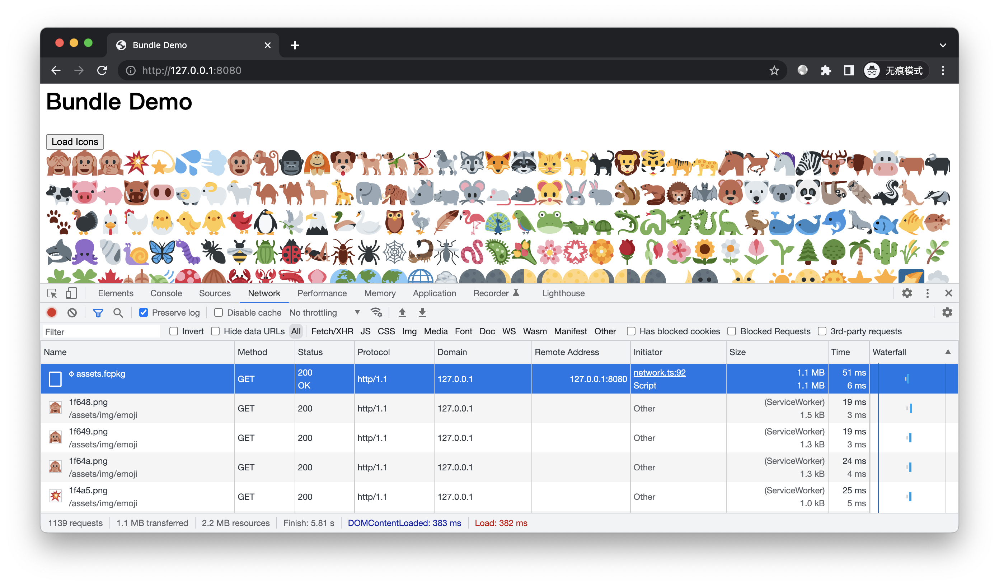

# 简介

演示将多个小文件打包成一个资源包，运行时通过 Service Worker 从中提取。

我们以之前讲解的 [外部清单](../ext-manifest/README.md) 这篇为案例 —— 该页面使用了 1000 多个图片文件，导致清单变得很大，于是将完整清单保存到免费 CDN，主清单通过外链的方式将其引入，从而降低自己站点的流量。

对于这种场合，现在我们有更好的解决方案了。不仅清单更简洁，而且性能更高！


# 预备

进入本案例 `www` 目录，开启 HTTP 服务，创建前端脚本：

```bash
freecdn js --make
```


# 开始

## 打包

使用 [freecdn pack](../../docs/cli/README.md#pack) 命令，将之前「外部清单」案例中所有资源文件进行打包：

```bash
freecdn pack -i ../../ext-manifest/www/assets -o assets.fcpkg
```

当前目录下得到资源包 assets.fcpkg 文件。

## 创建清单

出于演示，我们直接创建 `freecdn-manifest.txt` 清单文件：

```bash
/assets/
  bundle=/assets.fcpkg
```

这里使用目录匹配的方式，拦截 /assets/ 路径下所有请求。注意目录匹配必须以 `/` 结尾。

bundle 参数的值为资源包 URL。程序根据请求路径，从中提取相应的内容。

## 效果预览

访问：http://127.0.0.1:8080



可见页面加载了大量资源，但实际网络请求只有几个。1000 多个图片最终都从 assets.fcpkg 这一个资源包中提取。由于避免了 1000 多个网络请求，加载性能比之前案例提高了很多。

当然，这种合并优化的思路过去就有，例如图片使用 Sprite 合并，JS/CSS 合并在一起。但传统方案有很大的局限性，只能将同类型的资源进行合并，并且资源切割提取的逻辑需在业务层实现，有一定的改造成本。

如今这种方案显然更为灵活，不仅能合并任意类型的文件，并且对业务是透明的，业务无需任何改造，只要浏览器支持 Service Worker 即可自动开启。


# 改进

bundle 参数值可以是普通 URL，也可以是清单中的文件。因此资源包可实现多个备用 URL，并且开启 Hash 校验。

我们将资源包 [上传到免费空间](../free-host/README.md#npm-空间) 同时导入数据库：

```bash
export NPM_PKG="free-host"
../../free-host/npm-upload.sh "assets.fcpkg"
```

搜索文件，保存清单：

```bash
freecdn find --save
```

观察清单，现在资源包可通过免费 CDN 加速了：

```bash
/assets.fcpkg
	https://unpkg.com/free-host@0.0.0-v90rEGxJwu2TBCPV/index.js
	https://cdn.jsdelivr.net/npm/free-host@0.0.0-v90rEGxJwu2TBCPV/index.js
	hash=1048576;onDac6KIBKj+JIjn026vj8rI6SqPI1fCGcTRZUExqJk=,sXv/uBmv4WzCCIjfaCCXccQRkwG6i3/GodF8l9El6SY=
	size=1090870
```

> 对于 .fcpkg 扩展名的文件，工具会视为图片、视频等媒体文件一样，生成多个 Hash，从而可实现流加载。

最后将目录匹配的配置 [custom.conf](custom.conf) 合并到清单：

```bash
freecdn manifest --merge ../custom.conf
```

再次访问 http://127.0.0.1:8080 即可发现资源包从免费 CDN 加载。


# 结尾

掌握本文案例后，你可以将网站中不常更新的零碎小文件合并成资源包，不仅能提高用户体验，还能减少资源发布，尤其适用于文件数量有限制的免费空间。