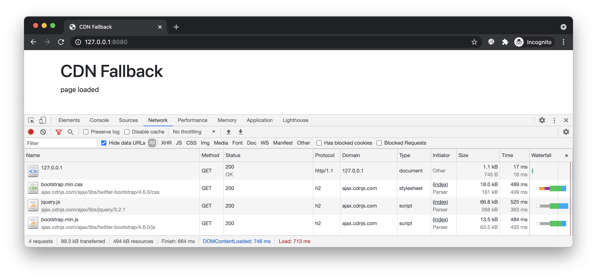
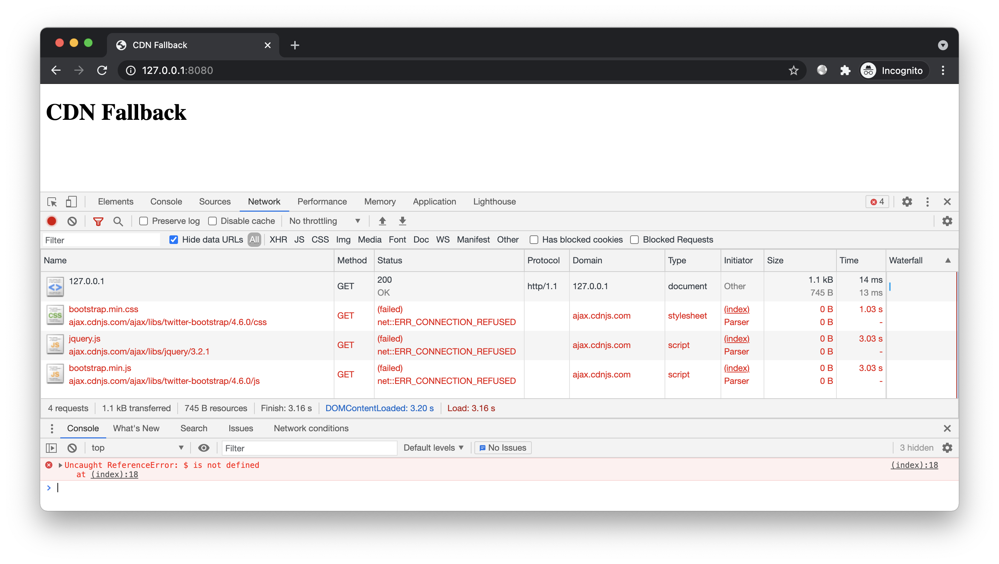
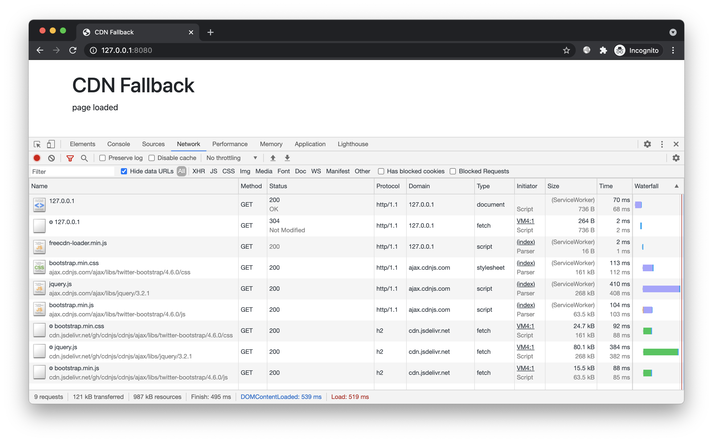
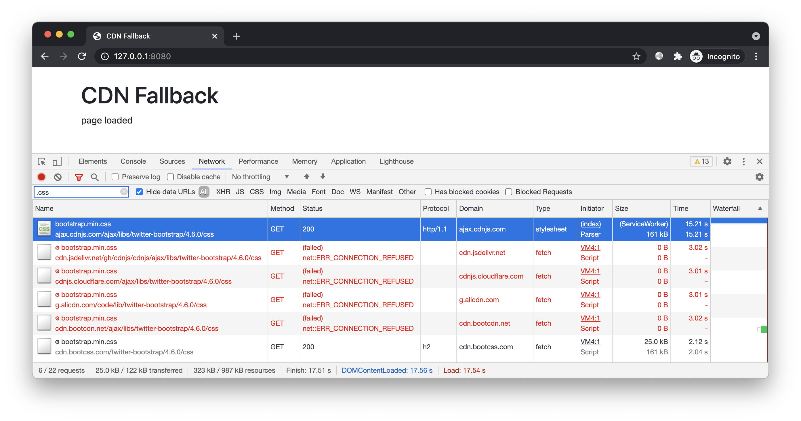
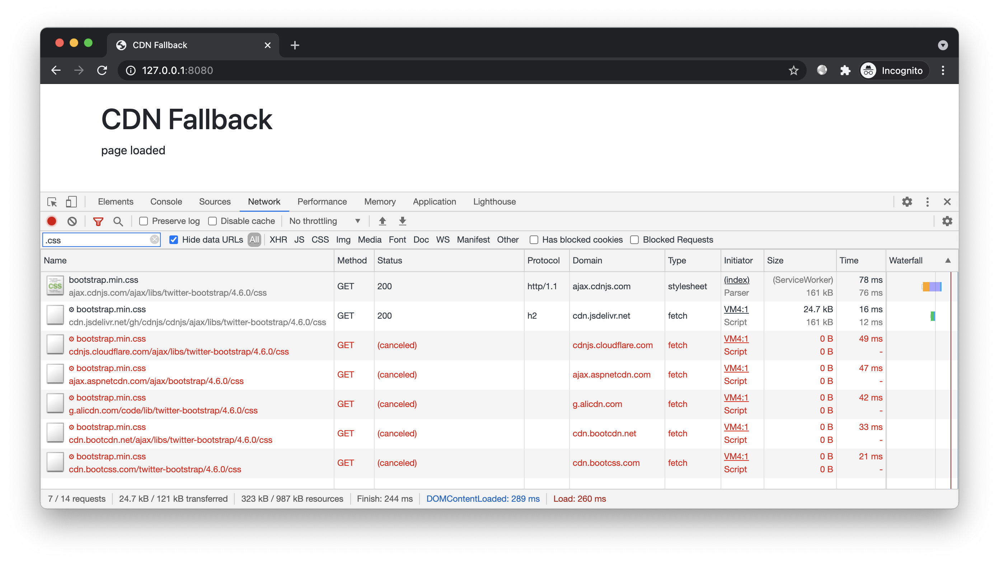

# 简介

演示 freecdn 自动切换故障 CDN 的效果。


# 预备

进入本案例 `www` 目录，开启 HTTP 服务：



该页面外链了 ajax.cdnjs.com 站点的 bootstrap 和 jquery 资源。正常情况下，页面显示 `page loaded`。

在 hosts 文件中添加 `0.0.0.0 ajax.cdnjs.com`，模拟 CDN 故障。再次访问页面，资源加载失败，控制台出现 `$ is not defined` 错误：



本案例我们演示如何在不修改业务逻辑的前提下，自动避开故障站点。


# 开始

## 搜索资源

由于该网页包含了外部资源，因此需提供 URL 列表文件，例如 [urls.txt](urls.txt)。搜索资源时，通过 `--with-urls` 选项指定该文件：

```bash
export FREECDN_RESOLVE=4
freecdn find --save --with-urls ../urls.txt
```

为避免工具使用本地 hosts 中的无效域名，这里使用 `FREECDN_RESOLVE` 环境变量让工具直接查询 DNS（类型 IPv4）。实际应用时无需设置该环境变量。

得到清单文件 `freecdn-manifest.txt`，内容大致如下：

```bash
https://ajax.cdnjs.com/ajax/libs/jquery/3.2.1/jquery.js
	https://cdnjs.cloudflare.com/ajax/libs/jquery/3.2.1/jquery.js
	https://cdn.jsdelivr.net/gh/cdnjs/cdnjs/ajax/libs/jquery/3.2.1/jquery.js
	https://cdnjs.loli.net/ajax/libs/jquery/3.2.1/jquery.js
	https://lib.baomitu.com/jquery/3.2.1/jquery.js
	https://cdn.staticfile.org/jquery/3.2.1/jquery.js
	https://cdn.bootcss.com/jquery/3.2.1/jquery.js
	https://cdn.bootcdn.net/ajax/libs/jquery/3.2.1/jquery.js
	https://unpkg.com/jquery@3.2.1/dist/jquery.js
	https://g.alicdn.com/code/lib/jquery/3.2.1/jquery.js
	https://pagecdn.io/lib/jquery/3.2.1/jquery.js
	https://ajax.aspnetcdn.com/ajax/jquery/jquery-3.2.1.js
	https://ajax.googleapis.com/ajax/libs/jquery/3.2.1/jquery.js
	https://code.jquery.com/jquery-3.2.1.js
	hash=DZAnKJ/6XZ9si04Hgrsxu/8s717jcIzLy3oi35EouyE=

...
```

和之前不同的是，这次的原文件名是绝对路径的第三方 URL。

> 工具目前不支持自动分析网站外链 URL。因为 URL 存在于 HTML、CSS、JSON 等众多格式的文件中，甚至还有 JS 动态生成的，程序难以完整覆盖，所以让开发者提供更简单

## 接入脚本

创建前端脚本：

```bash
freecdn js --make
```

在 `index.html` 头部引入：

```html
<script src="/freecdn-loader.min.js"></script>
```

## 效果预览

再次访问，页面显示 `page loaded`，故障排除！



继续测试。我们屏蔽更多 CDN，模拟更极端的情况：

```
0.0.0.0 ajax.cdnjs.com
0.0.0.0 cdnjs.cloudflare.com
0.0.0.0 cdn.jsdelivr.net
0.0.0.0 cdnjs.loli.net
0.0.0.0 lib.baomitu.com
0.0.0.0 cdn.staticfile.org
0.0.0.0 cdn.bootcdn.net
0.0.0.0 unpkg.com
0.0.0.0 g.alicdn.com
0.0.0.0 pagecdn.io
0.0.0.0 ajax.aspnetcdn.com
0.0.0.0 ajax.googleapis.com
0.0.0.0 code.jquery.com
```

为防止缓存，我们重新打开隐身窗口，再次访问：



前端依次尝试备用 URL，失败后继续下一个，直到获得可用 URL。虽然用时更久，但页面最终仍能正常展示。

## 并行尝试

如果你希望公共资源能更快加载，而不在流量消耗的话，可尝试「流量换速度」的策略 —— 同时从多个备用 URL 加载，哪个先完成就用哪个。

实现很简单，只需设置 `open_timeout` 参数：如果请求超时，程序将启动下一个 URL，之前的 URL 不会停止，仍继续下载。当某个 URL 完成后，其他 URL 会被终止。

如果超时时间为 0，即可同时开启多个 URL，立即开始竞赛。

```bash
https://ajax.cdnjs.com/ajax/libs/twitter-bootstrap/4.6.0/css/bootstrap.min.css
	https://cdnjs.cloudflare.com/ajax/libs/twitter-bootstrap/4.6.0/css/bootstrap.min.css
	https://cdnjs.loli.net/ajax/libs/twitter-bootstrap/4.6.0/css/bootstrap.min.css
	...
	open_timeout=0
```

恢复 hosts 文件，重新打开隐身窗口进行演示：



对于经常浏览网页的用户，常用的公共资源有较大概率已被其他站点加载过，这样即可直接从缓存读取，大幅减少加载时间。

## 配置合并

实际应用时，你无需手动修改清单文件，工具支持配置合并。

创建配置文件，例如 [custom.conf](custom.conf)（建议放在站点目录之外，因为它不属于站点资源。前面提到的 URL 列表文件也一样）：

```text
https://ajax.cdnjs.com/ajax/libs/twitter-bootstrap/4.6.0/css/bootstrap.min.css
	open_timeout=0
```

合并配置到当前清单：

```bash
freecdn manifest --merge ../custom.conf
```

这时清单 `freecdn-manifest.txt` 中相应的 URL 就会出现 `custom.conf` 中预设的配置。


# 结尾

有时间的话还可通过 charles、fiddler 等工具模拟更多异常情况，例如延时过高、带宽过低、DNS 劫持、内容篡改、证书错误等，观察 freecdn 如何处理这些异常情况。
