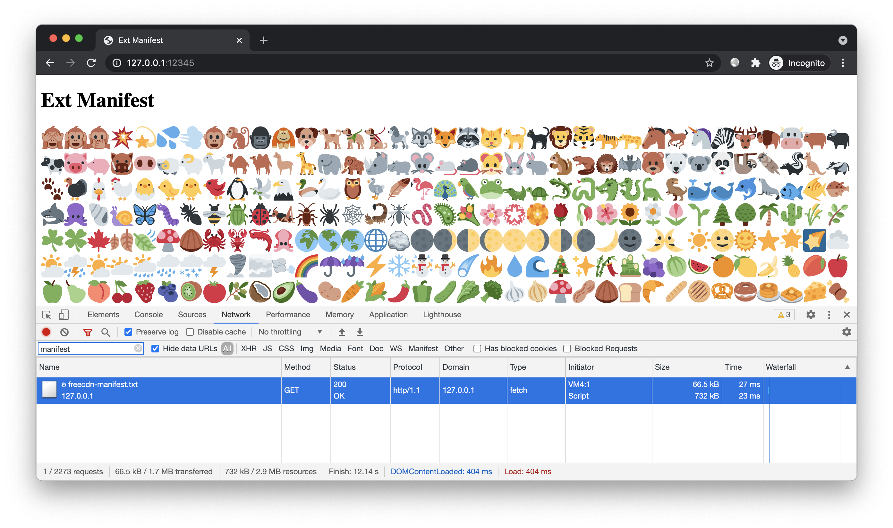
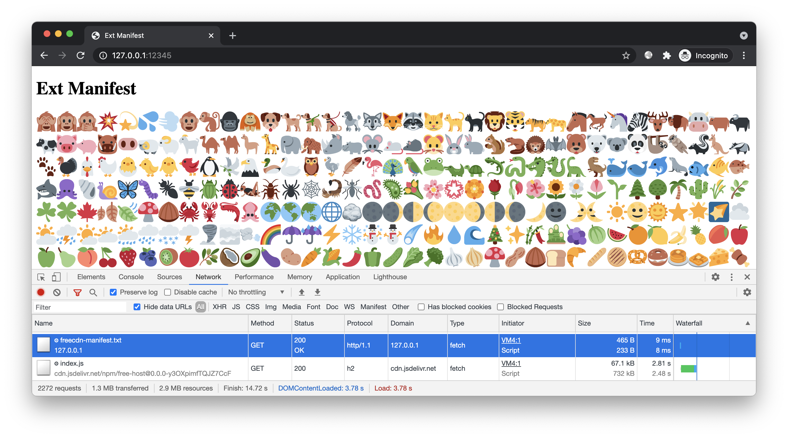

# 简介

演示将清单存储在免费 CDN 上，减少当前站点流量消耗。


# 预备

进入本案例 `www` 目录，创建前端脚本，生成清单：

```bash
freecdn js --make
freecdn find --save
```

为避免首次方式时不少资源仍从当前站点加载，本案例使用透明接入模式。

修改 [nginx 配置](../nginx/nginx.conf)，将 `root` 设置成 `../../ext-manifest/www`，重启服务。访问页面：http://127.0.0.1:12345



该站点有 1000 多个 emoji 图片，都能通过免费 CDN 加速。

由于文件数量较多，导致当前站点下的清单文件有几百 kB（压缩后几十 kB）。虽然不算大，但仍不完美。我们的终极目标是所有较大的静态资源都能从免费 CDN 加载，自己的站点只需提供几个极小的文件。


# 开始

## 外部清单

这一次，我们使用自定义的清单文件名：

```bash
freecdn find --save manifest-full.txt
```

参考上一个案例，将 `manifest-full.txt` 上传到免费 CDN 并导入数据库：

```bash
export NPM_PKG="free-host"
../../free-host/npm-upload.sh manifest-full.txt
```

## 本站清单

当前站点的清单只需记录一个文件，即 `manifest-full.txt` 的 URL 和 Hash：

```bash
freecdn find --filter manifest-full.txt --save
```

创建引用外部清单的配置文件 [custom.conf](custom.conf)：

```bash
@include
	/manifest-full.txt
```

合并该配置到当前站点清单：

```bash
freecdn manifest --merge ../custom.conf
```

当前站点的清单最终很简短：

```bash
/manifest-full.txt
	https://unpkg.com/free-host@0.0.0-y3OXpimfTQJZ7CcF/index.js
	https://cdn.jsdelivr.net/npm/free-host@0.0.0-y3OXpimfTQJZ7CcF/index.js
	hash=y3OXpimfTQJZ7CcFtPya+i2I3sCYnm9EIBlrqBCXcm0=

@include
	/manifest-full.txt
```

## 效果预览

新建隐身窗口，再次访问：http://127.0.0.1:12345



现在，完整清单也能从免费 CDN 加载了。当前站点只需提供一个几百字节的入口清单，体积减少近千倍。

## 挑战极限

我们来挑战下，当前站点最少只需消耗多少流量，就能让用户浏览所有内容。

* 将站点下的 JS、HTML 等私有文件上传到免费 CDN（使用 `freecdn find --show-unmatched` 可列出无法搜到的文件，避免上传公共文件）

* 生成完整清单，上传到免费 CDN（该清单包含了 1000 多个公共文件和几个私有文件）

* 本站清单引用完整清单

```bash
export NPM_PKG="free-host"
../../free-host/npm-upload.sh $(freecdn find --show-unmatched)

freecdn find --save manifest-full.txt
../../free-host/npm-upload.sh manifest-full.txt

freecdn find --filter manifest-full.txt --save
freecdn manifest --merge ../custom.conf
```

测试没问题后清空 nginx 日志（examples/nginx/nginx/logs/access.log），新建隐身窗口再次访问。

查看日志，只有 3 个请求：

* `/`（透明接入模式的安装页，压缩后 ~100 字节）

* `/freecdn-loader.min.js`（loader-js，压缩后 ~500 字节）

* `/freecdn-manifest.txt`（本站清单，压缩后 ~200 字节）

尽管页面引用了 1000 多个相对路径的资源，总共数 MB，但我们的站点只需提供 3 个极小的文件，总共不到 1kB！


# 结尾

掌握本文案例后，你可以将网站流量成本压榨到极致。每个用户只需消耗当前站点极少流量就能浏览所有内容，无论内容有多少。