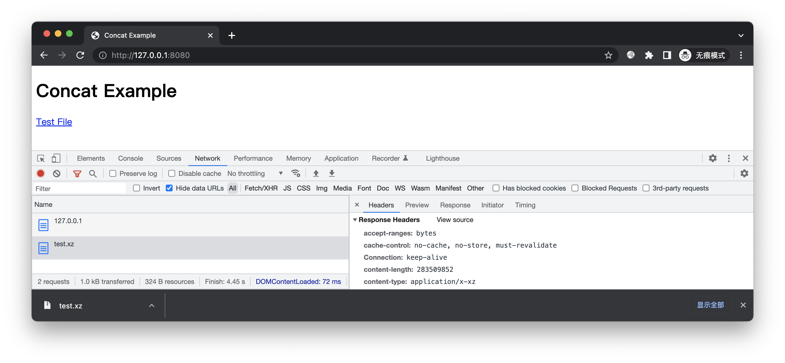
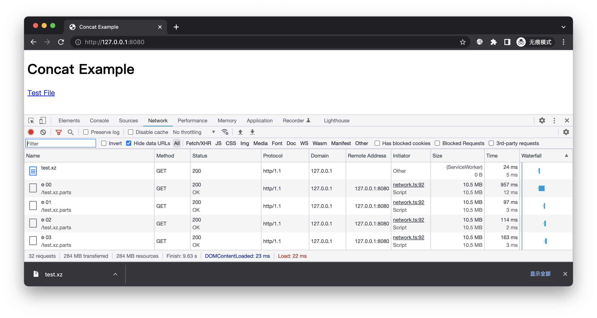
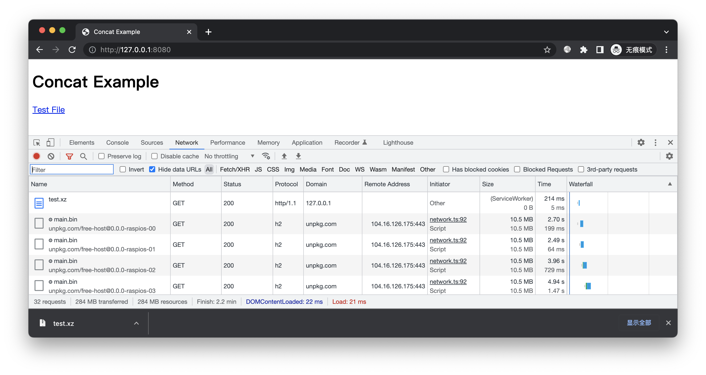

# 简介

演示将大文件切分成多个小文件，运行时通过 Service Worker 自动合并。


# 预备

进入本案例 `www` 目录，放一个大文件用于测试。这里使用树莓派镜像文件：

```bash
curl -o test.xz https://downloads.raspberrypi.org/raspios_lite_arm64/images/raspios_lite_arm64-2022-04-07/2022-04-04-raspios-bullseye-arm64-lite.img.xz
```

开启 HTTP 服务：



点击可下载该文件。现在我们开始改造，将大文件自动映射到多个小文件上。


# 开始

## 文件切割

对 test.xz 进行切割，每片 10MiB，结果保存到 test.xz.parts 目录：

```bash
mkdir -p test.xz.parts
split -b 10MiB -d test.xz test.xz.parts/
```

浏览目录，可见 00、01、02、...、27 文件。除了最后一片，其他都是 10,485,760 字节。

## 创建清单

出于演示，我们手动创建 `freecdn-manifest.txt` 清单文件：

```bash
/test.xz
	concat=10MiB /test.xz.parts/[00-27]
	size=283509852
```

注意点：

* 范围起始使用 `00` 而不是 0。如果是 0 对应的文件是 0、1、2、...、27，不符合上述切片的命名；如果是 00 则是 00、01、02、...、27，数字长度会被补齐

* 切片单位使用 `MiB` 而不是 MB，也不是 Mb。本项目 ki、Mi 等使用 1024 为底数，k、M 使用 1000 为底数；B 表示字节，b 表示比特。（细节参考 [字节单位](../../docs/manifest/unit.md#字节单位)）

* size 参数可选。如果省略的话，下载时无法获知文件长度，因此无法显示进度，用户体验不好

## 接入脚本

创建前端脚本：

```bash
freecdn js --make
```

在 `index.html` 头部接入脚本：

```html
<script src="/freecdn-loader.min.js"></script>
```

## 效果预览

再次访问页面，下载保存。可见浏览器没有请求大文件，而是加载了多个小文件：



## 文件上传

我们将切片上传到免费空间。出于简单，这里使用 NPM 作为免费空间，然后通过 unpkg.com 等站点访问。

<details>
<summary>NPM 上传细节</summary>

由于切片的总大小超过了 NPM 单包限制，因此得分多次发布。

最简单的办法，就是一个包存储一个切片，例如 `v0.0.0-file-01` 版本放 01 文件，`v0.0.0-file-02` 版本放 02 文件。。。

```bash
NPM_PKG="free-host"
FILE_NAME="raspios"

cd test.xz.parts
dst=$(mktemp -d)

for file in *; do
  cp -f $file $dst/main.bin
  conf='{"name": "'$NPM_PKG'", "version": "0.0.0-'$FILE_NAME'-'$file'"}'
  echo "$conf" > $dst/package.json
  npm publish $dst
done
```
</details>

得到切片 URL：

* `https://unpkg.com/free-host@0.0.0-raspios-00/main.bin`

* `https://unpkg.com/free-host@0.0.0-raspios-01/main.bin`

* ...

* `https://unpkg.com/free-host@0.0.0-raspios-27/main.bin`

更新清单：

```bash
/test.xz
	concat=10MiB https://unpkg.com/free-host@0.0.0-raspios-[00-27]/main.bin
	size=283509852
```

再次访问页面，下载保存。现在切片从免费 CDN 加载：



在线演示：https://freecdn.etherdream.com/raspios.xz

## 备用地址

除了 unpkg.com，还有其他站点也可以访问 NPM 文件，例如 npm.elemecdn.com，因此我们可设置多个备用地址：

```bash
/test.xz
	concat=10MiB /npm/free-host@0.0.0-raspios-[00-27]/main.bin
	size=283509852

/npm/
	https://npm.elemecdn.com/
	https://unpkg.com/
	recv_timeout=5MB/5s
```

切片可使用清单中的文件。出于简单，我们无需在清单中定义所有切片文件，使用 [目录匹配](../../docs/manifest/README.md#目录匹配) 即可。

我们定义 `/npm/` 这个虚拟目录，拦截所有 `/npm/...` 请求，然后将 `...` 代理到合适的 CDN。

此外我们通过 recv_timeout 参数监控下载速度。如果连续 5s 接收量少于 5MB 则开启下一个 URL，多线同时下载该切片，谁的数据块先到就用谁的。这样可防止长时间卡在某个速度慢的 CDN 上。

在线演示：https://freecdn.etherdream.com/raspios-faster.xz

# 结尾

既然大文件可通过免费 CDN 加速，那么自己站点上是否仍需保留它们？这取决于你的策略。如果你希望低版本浏览器仍能下载，那么需保留。此外，当免费 CDN 出现问题时，程序会使用原始 URL 作为后备资源，因此留着可进一步增加稳定性。

当然，如果你网站的用户几乎都是高版本浏览器，并且 CDN 备用地址充足，那么原文件不保留也没事。