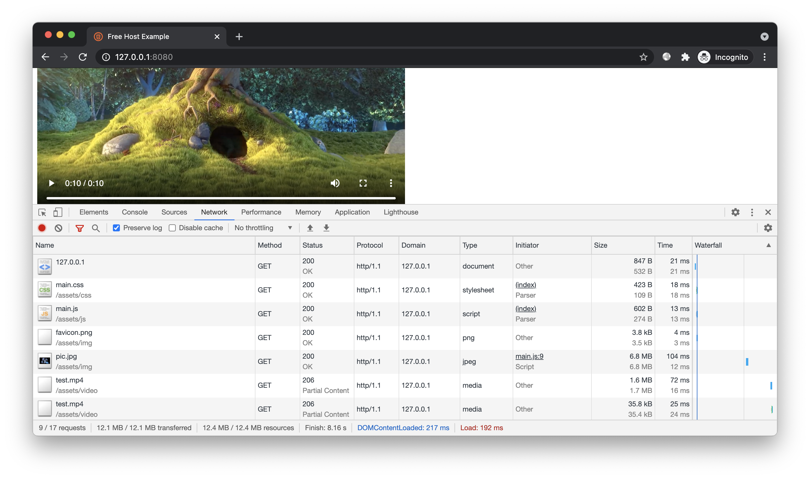
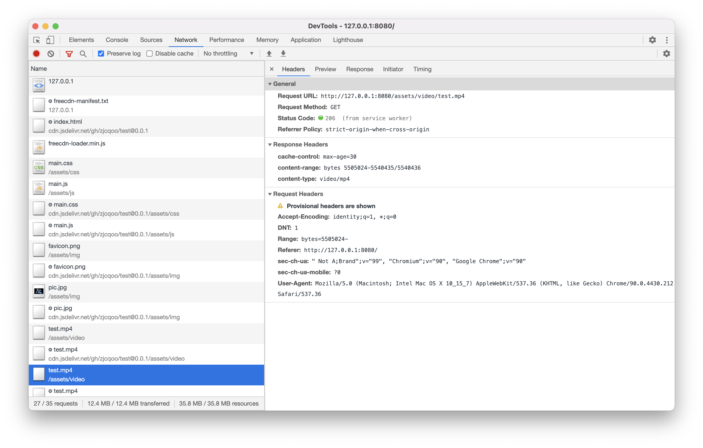
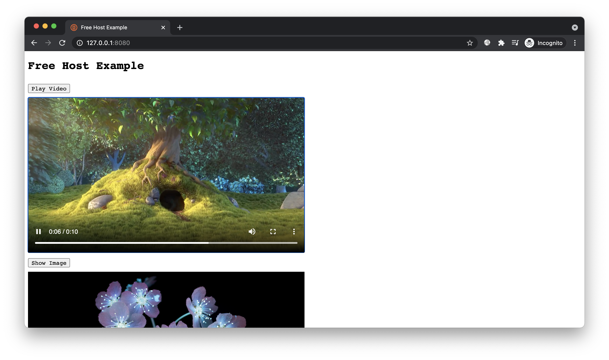
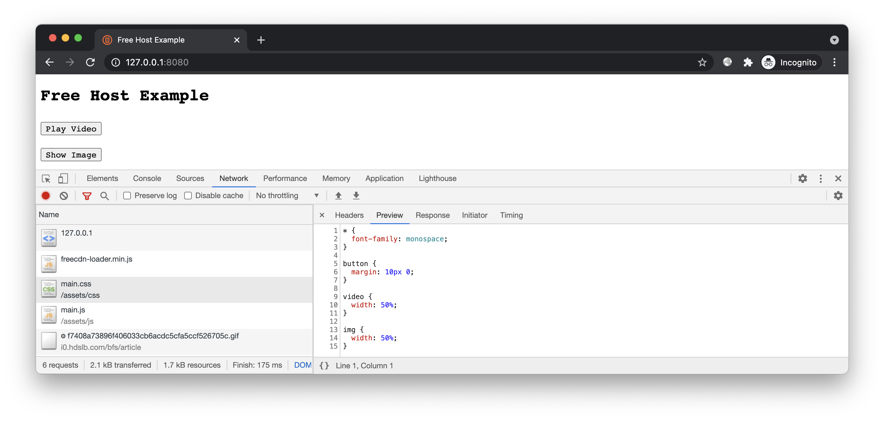

# 简介

演示使用免费 CDN 加速任意资源。


# 预备

进入本案例 `www` 目录，开启 HTTP 服务：



点击按钮可显示视频和图片。正常情况下，这些资源都从当前站点加载。

本案例我们演示如何在不修改业务逻辑的前提下，将所有资源甚至包括 HTML 页面都从免费 CDN 加载。


# 开始

## 接入脚本

这次需要先在页面中接入脚本，然后再上传。因为实际使用时的页面是包含该脚本的。

创建前端脚本：

```bash
freecdn js --make
```

在 `index.html` 头部引入：

```html
<script src="/freecdn-loader.min.js"></script>
```

## 免费空间

出于简单，我们先用 GitHub 作为免费空间。上传当前目录下所有文件到指定仓库：

```bash
USER=zjcqoo
REPO=test
VER=0.0.1

git init
git remote add origin https://github.com/$USER/$REPO.git
git add .
git commit -m upload
git tag $VER
git push origin master $VER
```

GitHub 提供了 `raw.githubusercontent.com` 站点，可通过 HTTP 访问仓库中的文件，例如：

https://raw.githubusercontent.com/zjcqoo/test/0.0.1/index.html

此外，还有一些第三方 CDN 也可以加速 GitHub 文件，例如 jsdelivr：

https://cdn.jsdelivr.net/gh/zjcqoo/test@0.0.1/index.html

由于 CDN 缓存时间很长，因此每次更新必须设置 tag，例如 0.0.1、0.0.2 递增，从而可使用不同的 URL 避开缓存。

## 导入记录

这次要搜索的是私有文件，显然无法在公共库中找到。我们需要先将文件 Hash 和 URL 导入数据库。

遍历当前站点下的文件，生成 Hash 和 URL 列表：

```bash
files=$(find * -type f ! -path "freecdn-*" ! -name ".*")
list=""

for file in $files; do
  hash=$(openssl dgst -sha256 -binary $file | openssl base64 -A)
  list="$list
$hash https://raw.githubusercontent.com/$USER/$REPO/$VER/$file
$hash https://cdn.jsdelivr.net/gh/$USER/$REPO@$VER/$file"
done

echo "$list"
```

得到列表：

```
XTZpbfuMkxViYSW2q370udBiH6h2xPPsbA9GLxfBfBg= https://raw.githubusercontent.com/zjcqoo/test/0.0.1/assets/video/test.mp4
XTZpbfuMkxViYSW2q370udBiH6h2xPPsbA9GLxfBfBg= https://cdn.jsdelivr.net/gh/zjcqoo/test@0.0.1/assets/video/test.mp4
L4HFRlSKt3ggTXAKWFWe5OQCyXsn+1ZWBIGdGE2g/MQ= https://raw.githubusercontent.com/zjcqoo/test/0.0.1/assets/css/main.css
L4HFRlSKt3ggTXAKWFWe5OQCyXsn+1ZWBIGdGE2g/MQ= https://cdn.jsdelivr.net/gh/zjcqoo/test@0.0.1/assets/css/main.css
caiXDXaiAH8XxHZdkzMuV0GiM0lLr1wRQ4eVctaKHKQ= https://raw.githubusercontent.com/zjcqoo/test/0.0.1/assets/js/main.js
caiXDXaiAH8XxHZdkzMuV0GiM0lLr1wRQ4eVctaKHKQ= https://cdn.jsdelivr.net/gh/zjcqoo/test@0.0.1/assets/js/main.js
Fg/gKJKGuOIx57Ho2Kr+xYyy0KJJR8D4yws6qNf1k18= https://raw.githubusercontent.com/zjcqoo/test/0.0.1/assets/img/favicon.png
Fg/gKJKGuOIx57Ho2Kr+xYyy0KJJR8D4yws6qNf1k18= https://cdn.jsdelivr.net/gh/zjcqoo/test@0.0.1/assets/img/favicon.png
cdVzXONwA1MiVj/5ywlEXtcAmGRaXkI5NQI8h26VvuI= https://raw.githubusercontent.com/zjcqoo/test/0.0.1/assets/img/pic.jpg
cdVzXONwA1MiVj/5ywlEXtcAmGRaXkI5NQI8h26VvuI= https://cdn.jsdelivr.net/gh/zjcqoo/test@0.0.1/assets/img/pic.jpg
1lZrk8wvUYweiDaCPB/LayLG2X8jh/7ln9l66boQVMU= https://raw.githubusercontent.com/zjcqoo/test/0.0.1/index.html
1lZrk8wvUYweiDaCPB/LayLG2X8jh/7ln9l66boQVMU= https://cdn.jsdelivr.net/gh/zjcqoo/test@0.0.1/index.html
```

导入数据库：

```bash
freecdn db --import <<< "$list"
```

查看数据库：

```bash
freecdn db --list
```

## 生成清单

搜索文件，保存清单：

```bash
freecdn find --save
```

得到清单文件 `freecdn-manifest.txt`，内容大致如下：

```bash

/index.html
	https://raw.githubusercontent.com/zjcqoo/test/0.0.1/index.html
	https://cdn.jsdelivr.net/gh/zjcqoo/test@0.0.1/index.html
	hash=1lZrk8wvUYweiDaCPB/LayLG2X8jh/7ln9l66boQVMU=

/assets/js/main.js
	https://raw.githubusercontent.com/zjcqoo/test/0.0.1/assets/js/main.js
	https://cdn.jsdelivr.net/gh/zjcqoo/test@0.0.1/assets/js/main.js
	hash=caiXDXaiAH8XxHZdkzMuV0GiM0lLr1wRQ4eVctaKHKQ=
...
```

现在，我们自己的文件也可通过 CDN 加速了。

## 效果预览

再次访问，所有资源包括 HTML 页面都被 Service Worker 代理到了免费 CDN：





也许你会问，把 HTML 文件代理到 CDN 有什么意义，首次访问时不已经从当前站点加载过了吗？

事实上在普通模式下加速 HTML 文件意义确实不大，因为首次访问时 Service Worker 未安装，HTML 文件甚至很多资源仍从当前站点加载。但如果使用 [透明接入模式](../../docs/transparent-mode/README.md)，首次访问时后端返回的是 Service Worker 安装页，安装完成后页面自动刷新，此时即可直接从 CDN 加载 HTML 文件，而无需经过当前站点，更快并且更省流量。

## NPM 空间

类似的，还可以把文件发布到 NPM 仓库，通过 unpkg.com 和 jsdelivr 进行加速。

注意，无论 GitHub 还是 NPM，每次发布都需设置一个递增的版本号。并且只有 **新文件的 URL 使用新版本号，旧文件的 URL 保持不变，仍使用原先的版本号**，这样可充分利用 CDN 缓存，避免不必要的回源。

如果你觉得维护文件版本号有些麻烦，倒是有一个简单取巧的办法 —— 使用文件 Hash 作为版本号。例如 NPM 的版本号允许设置 [pre-release](https://semver.org/#spec-item-9) 后缀，类似 `1.0.0-alpha` 可携带任意字符。

我们可使用文件 Hash 作为版本后缀，并且每次只发布一个文件。文件名随意，尽量使用文本格式的扩展名，从而能被 CDN 压缩传输。例如：

`https://unpkg.com/free-host@0.0.0-1lZrk8wvUYweiDaC/index.js`

`https://unpkg.com/free-host@0.0.0-L4HFRlSKt3ggTXAK/index.js`

这样就不用单独维护每个文件的版本了，所有文件都是 0.0.0 版本，后缀也是由文件内容决定。如果存在多个内容相同的文件，它们还可共享同个 URL（有点类似 IPFS）。

登录 NPM，设置 `$NPM_PKG` 为需发布的包名，然后执行上传脚本：

```bash
export NPM_PKG="free-host"
../npm-upload.sh $(find * -type f ! -path "freecdn-*" ! -name ".*")
```

即可上传指定的文件到该 NPM 包，并将它们的 Hash 和 URL 导入数据库。

重新生成清单，我们多了两个备用 URL：

```diff
/index.html
	https://raw.githubusercontent.com/zjcqoo/test/0.0.1/index.html
	https://cdn.jsdelivr.net/gh/zjcqoo/test@0.0.1/index.html
+	https://unpkg.com/free-host@0.0.0-1lZrk8wvUYweiDaC/index.js
+	https://cdn.jsdelivr.net/npm/free-host@0.0.0-1lZrk8wvUYweiDaC/index.js
	hash=1lZrk8wvUYweiDaCPB/LayLG2X8jh/7ln9l66boQVMU=

/assets/js/main.js
	https://raw.githubusercontent.com/zjcqoo/test/0.0.1/assets/js/main.js
	https://cdn.jsdelivr.net/gh/zjcqoo/test@0.0.1/assets/js/main.js
+	https://unpkg.com/free-host@0.0.0-caiXDXaiAH8XxHZd/index.js
+	https://cdn.jsdelivr.net/npm/free-host@0.0.0-caiXDXaiAH8XxHZd/index.js
	hash=caiXDXaiAH8XxHZdkzMuV0GiM0lLr1wRQ4eVctaKHKQ=
...
```

由于 jsdelivr 既能加速 GitHub，又能加速 NPM，因此选择其中一个即可。例如删除数据库中 GitHub 的记录：

```bash
freecdn db --del-url "https://cdn.jsdelivr.net/gh/*" --wildcard
```

重新生成清单，现在备用 URL 不会有多个 jsdelivr 资源了。


## 图床空间

事实上，图床、相册等站点也可用于免费 CDN，加速图片下载。只要备用 URL 充足，完全不用担心失效。

除了图片文件，其他类型的文件也可编码成图片上传，然后在前端解码。例如将 CSS 文件附在某个 GIF 文件的末尾：

```bash
cat ../foo.gif assets/css/main.css > /tmp/upload.gif
```

然后上传 `upload.gif` 到各大网站的相册：

`https://i0.hdslb.com/bfs/article/f7408a73896f406033cb6acdc5cfa5ccf526705c.gif`

`https://upload-images.jianshu.io/upload_images/6294093-381dbf051f81df32.gif`

...

由于该文件的前面部分是图片，因此使用时需指定读取位置，可通过 pos 参数实现。

我们先手动修改清单进行演示。上述 foo.gif 的长度为 433 字节：

```bash
/assets/css/main.css
	https://i0.hdslb.com/bfs/article/f7408a73896f406033cb6acdc5cfa5ccf526705c.gif
	https://upload-images.jianshu.io/upload_images/6294093-381dbf051f81df32.gif
	pos=433
```

访问页面，成功从图片中还原出 CSS 内容：



类似的，图片也可导入数据库，从而能被搜索到。和之前不同的是，你要在 URL 末尾的片段部分定义参数信息：

```bash
freecdn db --import <<< "
L4HFRlSKt3ggTXAKWFWe5OQCyXsn+1ZWBIGdGE2g/MQ= https://i0.hdslb.com/bfs/article/f7408a73896f406033cb6acdc5cfa5ccf526705c.gif#pos=433
L4HFRlSKt3ggTXAKWFWe5OQCyXsn+1ZWBIGdGE2g/MQ= https://upload-images.jianshu.io/upload_images/6294093-381dbf051f81df32.gif#pos=433
"
```

重新生成清单：

```diff
/assets/css/main.css
	https://raw.githubusercontent.com/zjcqoo/test/0.0.1/assets/css/main.css
	https://unpkg.com/free-host@0.0.0-L4HFRlSKt3ggTXAK/index.js
	https://cdn.jsdelivr.net/npm/free-host@0.0.0-L4HFRlSKt3ggTXAK/index.js
+	https://i0.hdslb.com/bfs/article/f7408a73896f406033cb6acdc5cfa5ccf526705c.gif#pos=433
+	https://upload-images.jianshu.io/upload_images/6294093-381dbf051f81df32.gif#pos=433
	hash=L4HFRlSKt3ggTXAKWFWe5OQCyXsn+1ZWBIGdGE2g/MQ=
...
```

现在完全不用担心免费空间不够用了。大量的图床相册都可充当免费 CDN 节点，加速任意类型的资源。


# 结尾

掌握本文案例后，你可实现全站资源免费加速，大幅降低流量成本。

不过资源数量很多的话，清单文件会变得很大，从而消耗当前站点不少流量，这仍不完美。[下一个案例](../ext-manifest/)，我们继续改进，将清单文件也存储在免费 CDN 上，进一步节省流量成本。