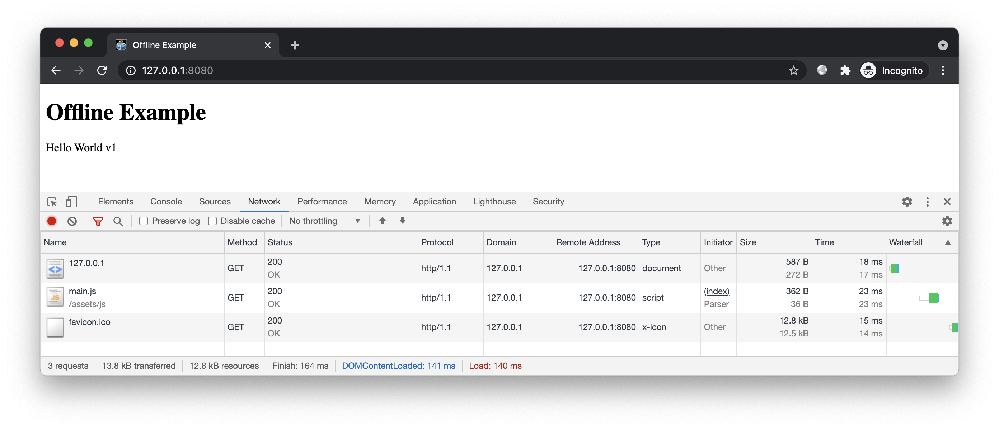
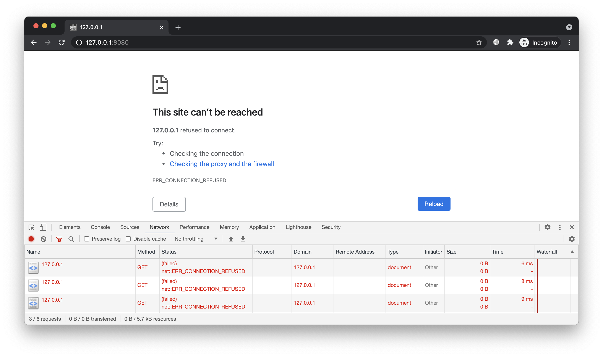
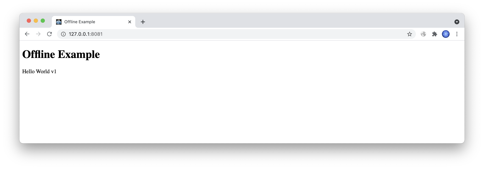
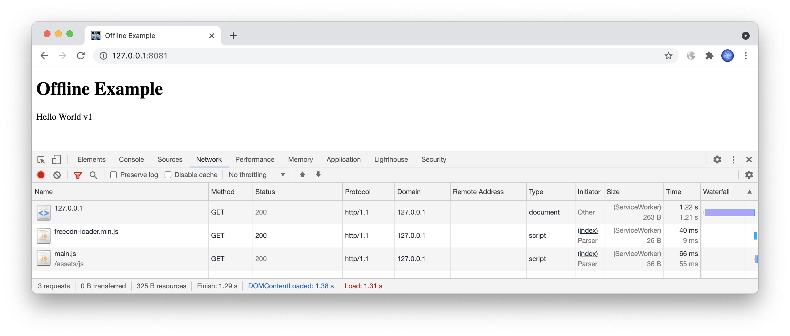
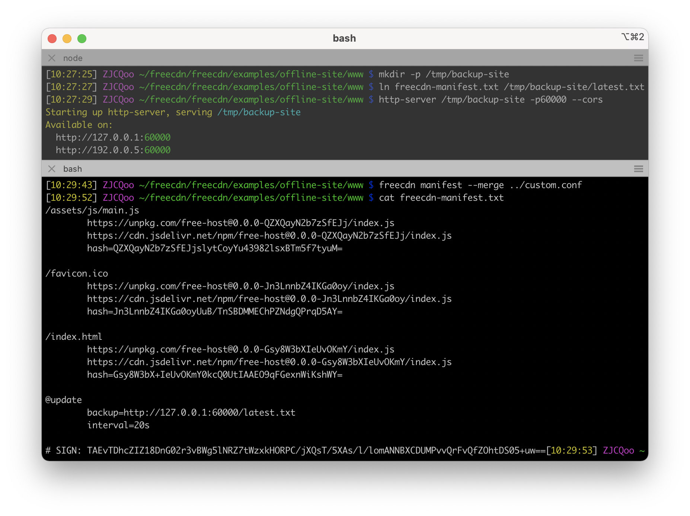
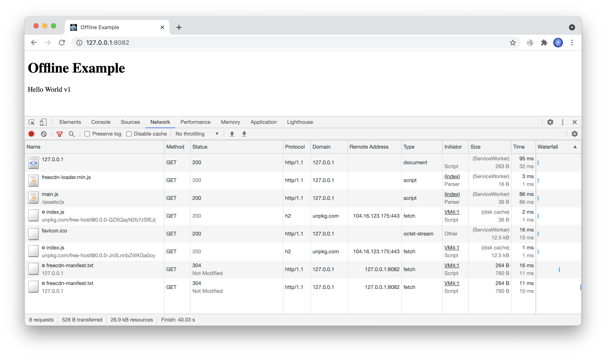
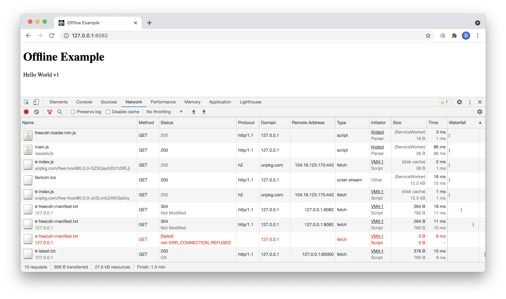

# 简介

演示网站离线运行的效果。


# 预备

进入本案例 `www` 目录，开启 HTTP 服务：



关闭 HTTP 服务，刷新页面，显示无法访问此网站：



现在我们为该站点加上离线访问的能力。用户只要访问过一次，之后即使服务器关闭也能访问，甚至还能更新。


# 开始

要实现离线访问，当前站点下所有文件（包括 HTML 文件）都必须有备用 URL，从而可不依赖当前站点。

## 接入脚本

和之前免费空间的案例一样，这次也是先在页面中接入脚本，然后再上传。

创建前端脚本：

```bash
freecdn js --make
```

在 `index.html` 头部引入：

```html
<script src="/freecdn-loader.min.js"></script>
```

## 上传文件

参考之前的案例，上传 HTML、JS 等私有文件到免费 CDN 并导入数据库：

```bash
export NPM_PKG="free-host"
../../free-host/npm-upload.sh $(freecdn find --show-unmatched)
```

## 生成清单

搜索文件保存清单，并对清单进行私钥签名：

```bash
freecdn find --save
freecdn manifest --sign
```

签名结果保存在清单末尾。离线模式下 freecdn 会使用 Cache Storage 中缓存的清单，如果没有签名，则无法验证其完整性（缓存的清单可能会被恶意脚本篡改）。

## 效果预览

开启 HTTP 服务，进行首次访问（可以换一个端口，**不要使用隐身模式**）：



关闭 HTTP 服务，关闭页面，退出浏览器（甚至可以重启电脑）。

打开浏览器，再次访问：



页面依然可以展示，甚至不断刷新也没问题！

> 事实上网站能离线访问并不是什么新鲜事，这原本就是 Service Worker 的设计初衷，可让页面在无网络的场合下使用，这也是 WebApp 的基础。


# 改进

离线模式虽能营造出故障站点仍可访问的效果，但由于无法从当前站点获取最新的清单，导致网站无法更新。

为此 freecdn 支持备用清单：

```bash
@update
	backup=url1 url2 ...
```

如果当前站点发生故障，程序可从备用站点获取最新的清单。

注意，既然是最新的清单，文件内容显然是会变化的，但 URL 是固定的，因此不推荐使用 jsdelivr、unpkg 这类无法 PURGE 缓存的 CDN。

## 备用站点

我们创建一个临时目录，用于存放最新的清单文件，模拟备用站点：

```bash
mkdir -p /tmp/backup-site

ln freecdn-manifest.txt /tmp/backup-site/latest.txt

http-server /tmp/backup-site -p60000 --cors
```

出于简单，这里直接将 `latest.txt` 链接到清单文件，从而保持内容同步。实际应用中，你需要自己同步清单文件到备用站点。

作为第三方站点，这里需要开启 CORS。

## 前端配置

创建 [配置文件](custom.conf)：

```bash
@update
	backup=http://127.0.0.1:60000/latest.txt
	interval=20s
```

出于演示，这里降低了更新轮询的间隔，程序每隔 20s 加载一次清单（默认 300s）。

合并配置到当前清单（签名会自动更新）：

```bash
freecdn manifest --merge ../custom.conf
```



## 效果预览

开启 HTTP 服务，进行首次访问（可以换一个端口，**不要使用隐身模式**）：



一切正常的话，前端每隔 20s 加载 `/freecdn-manifest.txt`，检测清单是否有更新。

关闭当前站点 HTTP 服务，之后前端加载 `/freecdn-manifest.txt` 出现失败，但会立即尝试 `http://127.0.0.1:60000/latest.txt`，说明备用机制已生效。



关闭页面，退出浏览器。

我们修改 `assets/js/main.js`，模拟网站更新：

```js
label.textContent = 'Hello World v2'
```

重新上传该文件到免费 CDN，重新生成清单：

```bash
export NPM_PKG="free-host"
../../free-host/npm-upload.sh assets/js/main.js

freecdn find --save
freecdn manifest --merge ../custom.conf
freecdn manifest --sign
```

打开浏览器，再次访问：


页面显示的是最新内容！

由此可见，即使服务器关闭，浏览器重启，但只要之前访问过一次，之后不仅能浏览，还能保持更新。


# 结尾

掌握本文案例后，你可以大幅提升网站稳定性，尤其是静态页面的站点，即使服务器被 DDOS 攻击打垮，之前访问过的用户仍能正常浏览，甚至毫无感觉。