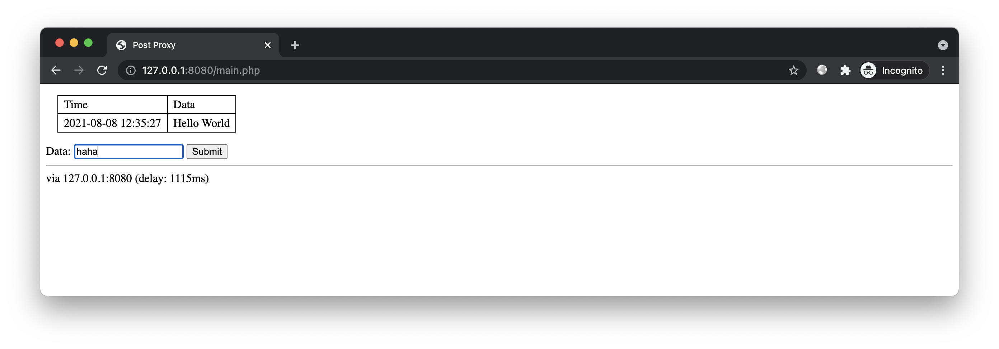
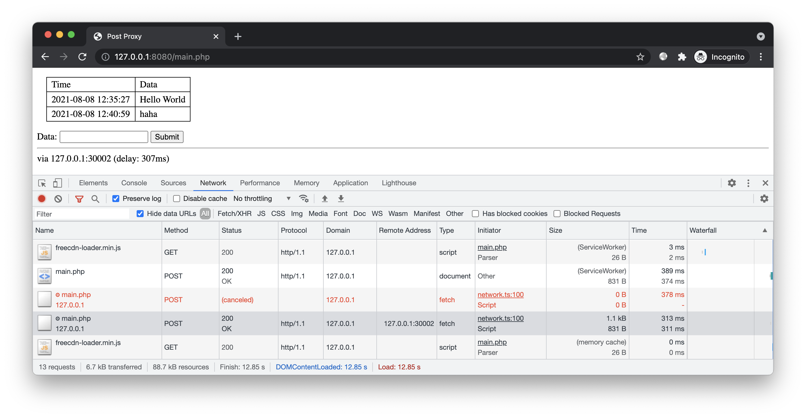

# 简介

演示将 POST 请求代理到多个备用服务器。


# 预备

进入本案例 `www` 目录，使用 `php` 命令开启 HTTP 服务：

```bash
php -S 127.0.0.1:8080
```

访问：http://127.0.0.1:8080/main.php



该页面可将提交的数据显示在列表中。出于简单，这里没用数据库，数据直接保存在 `../data/db.json` 文件中。

为了模拟网络不稳定性，`main.php` 开头人为使用 `sleep` 进行延时。`127.0.0.1:8080` 站点默认有 1s 左右的延时，页面底部显示了延时时间。

下面开始改造，我们使用延时更低的备用服务器加速 POST 请求。


# 开始

## 备用服务

为了方便测试，这里不使用真实服务器，而是用本地服务模拟。

开启第 1 个备用服务器：

```bash
php -S 127.0.0.1:30001
```

开启第 2 个备用服务器：

```bash
php -S 127.0.0.1:30002
```

确保两者都能正常访问：

* http://127.0.0.1:30001/main.php （延时 400~600ms）

* http://127.0.0.1:30002/main.php （延时 200~400ms）

## 生成清单

由于本案例加速的是动态 URL，因此需手动配置，例如 [custom.conf](custom.conf)：

```bash
/main.php
	http://127.0.0.1:30001/main.php
	http://127.0.0.1:30002/main.php
	req_headers={"content-type": ""}
	open_timeout=50
	stream=off
```

* 为了确保后端能正确解析请求数据，这里通过 [req_headers](../../docs/manifest/params.md#req_headers) 保留 `content-type` 请求头。

* 为了避免长时间阻塞在某个备用服务器上，这里通过 [open_timeout](../../docs/manifest/params.md#open_timeout) 设置 50ms 的最大请求时间，超时则启动下一个 URL。

* 由于动态接口的内容是不确定的，因此无需设置 `hash` 参数。但需设置 [stream](../../docs/manifest/params.md#stream) 参数禁用流模式，以防不同的服务器返回不同的结果，导致数据流错乱。


合并该配置到已有清单：

```bash
freecdn find --save
freecdn manifest --merge ../custom.conf
```

## 接入脚本

创建前端脚本：

```bash
freecdn js --make
```

在 `main.php` 的 `<head>` 后面引入脚本：

```html
<script src="/freecdn-loader.min.js"></script>
```

## 效果预览

由于页面入口仍是 `127.0.0.1:8080`，因此首次访问仍有 1s 左右的延迟。但页面刷新后即可从备用服务器加载，延时明显低了很多：



通过页面底部可见，该页面从第 2 个备用服务（`127.0.0.1:30002`）加载。因为第一个备用服务（`127.0.0.1:30001`）有 400~600ms 左右的延时，超出配置中 50ms 的最大请求时间。

通过控制台网络栏可见，提交的数据被分别发送到两个服务。响应快的被采纳，响应慢的被终止，呈红色的 canceled 状态。（需勾选保留日志，否则页面跳转后日志会被清空）

**注意，即使前端终止请求，后端可能已处理完毕。因此接口必须自带防重放功能，否则会出现提交多次的情况。**

## 冗余测试

关闭 127.0.0.1:30002 服务，再次提交数据，此时数据被转发到 127.0.0.1:30001 上。

继续关闭 127.0.0.1:30001 服务，此时数据被转发到 127.0.0.1:8080 上，即原始站点。由此可见，即使备用服务都不可用，请求仍能正常提交。


# 结尾

掌握本文案例后，你可将网站接口代理到稳定性不高但更廉价的服务器上，例如有公网 IP 的家用带宽，例如不开放 443 端口的云主机，从而减轻主服务器的流量和计算量。
