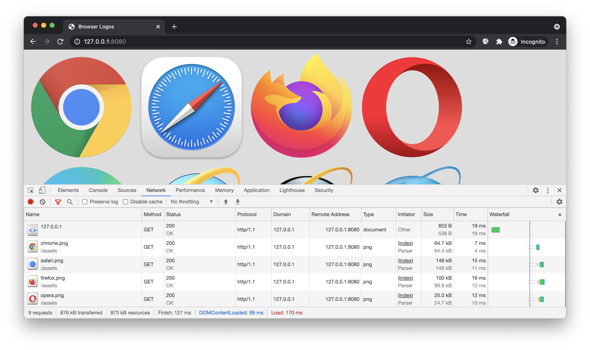
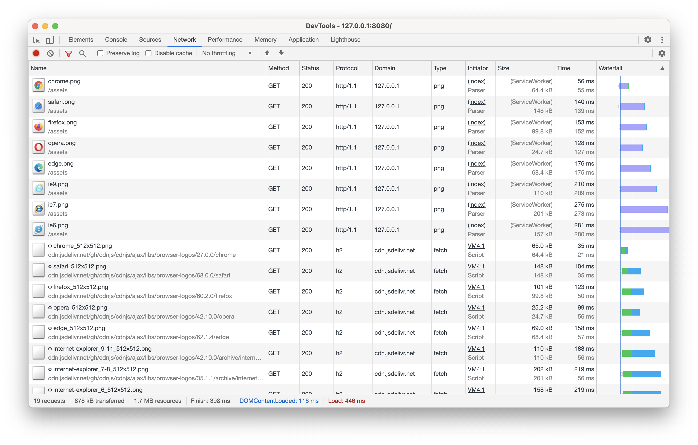
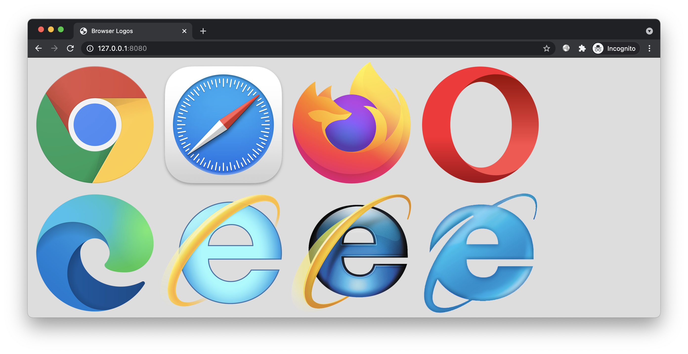

# 简介

演示使用免费 CDN 加速公共资源。


# 预备

进入本案例 `www` 目录，开启 HTTP 服务（这里使用 [http-server](https://www.npmjs.com/package/http-server) 工具）：

```bash
git clone https://github.com/EtherDream/freecdn
cd freecdn/examples/pub-cdn/www
http-server
```

本案例及后续案例，所有命令都在各自的 `www` 目录下执行。

访问演示页面。为避免缓存，建议使用隐身模式：



该页面有多个浏览器图标的图片。这些图片从当做站点加载，消耗当前站点的流量。

本案例我们演示如何在不修改图片路径的前提下，从免费 CDN 加载图片。


# 开始

## 工具安装

安装 freecdn 命令行工具：

```bash
npm install freecdn -g
```

## 生成清单

查询当前站点下，哪些文件可通过公共 CDN 加速，保存清单：

```bash
freecdn find --save
```

得到清单文件 `freecdn-manifest.txt`，内容大致如下：

```bash
/assets/chrome.png
	https://ajax.cdnjs.com/ajax/libs/browser-logos/27.0.0/chrome/chrome_512x512.png
	https://cdnjs.cloudflare.com/ajax/libs/browser-logos/27.0.0/chrome/chrome_512x512.png
	https://cdn.jsdelivr.net/gh/cdnjs/cdnjs/ajax/libs/browser-logos/27.0.0/chrome/chrome_512x512.png
	https://cdnjs.loli.net/ajax/libs/browser-logos/27.0.0/chrome/chrome_512x512.png
	https://lib.baomitu.com/browser-logos/27.0.0/chrome/chrome_512x512.png
	https://cdn.staticfile.org/browser-logos/27.0.0/chrome/chrome_512x512.png
	https://cdn.bootcdn.net/ajax/libs/browser-logos/27.0.0/chrome/chrome_512x512.png
	https://cdn.bootcss.com/browser-logos/27.0.0/chrome/chrome_512x512.png
	hash=qRgUkISo5k/bgIWNHGfLsC8WmasnE7jYdCZvthIFLno=

/assets/edge.png
	https://ajax.cdnjs.com/ajax/libs/browser-logos/62.1.4/edge/edge_512x512.png
	https://cdnjs.cloudflare.com/ajax/libs/browser-logos/62.1.4/edge/edge_512x512.png
	https://cdn.jsdelivr.net/gh/cdnjs/cdnjs/ajax/libs/browser-logos/62.1.4/edge/edge_512x512.png
	https://cdnjs.loli.net/ajax/libs/browser-logos/62.1.4/edge/edge_512x512.png
	https://lib.baomitu.com/browser-logos/62.1.4/edge/edge_512x512.png
	https://cdn.staticfile.org/browser-logos/62.1.4/edge/edge_512x512.png
	https://cdn.bootcdn.net/ajax/libs/browser-logos/62.1.4/edge/edge_512x512.png
	https://cdn.bootcss.com/browser-logos/62.1.4/edge/edge_512x512.png
	hash=e/QvJoMnfQFLXXrHe6ZC7v8IVc6cNuL7MqTY4h/L4ZQ=

...
```

格式很简单，每个原始文件对应多个备用文件，以及相应的参数。

## 接入脚本

创建前端脚本：

```bash
freecdn js --make
```

在 `index.html` 中引入脚本，位置越靠前越好，从而能更早加载。例如放在 `<head>` 后面：

```html
<head>
  <script src="/freecdn-loader.min.js"></script>
  ...
```

实际应用中，你需要给所有页面都引入，因为用户首次访问未必从首页进入，也可能是其他页面。推荐使用模板全局引入。

## 效果预览

再次访问，这些图片都被 Service Worker 代理到了公共 CDN：





具体代理到哪个 CDN，则是根据历史访问记录、用户所在地域、站点权重等多个因素决定的。

通常优先考虑最近加载过资源的 CDN，这样可避免 DNS 查询、TCP/HTTPS 握手等环节。例如上述图片被代理到了 jsdelivr，是因为 freecdn 初始化时主模块（freecdn-main.min.js）默认就从 jsdelivr 和 unpkg 加载，这两个站点已提前预热，之后会优先考虑。

此外，用户所在地域也是一个重要的因素。例如中国大陆的用户优先使用境内的 CDN，以避免延时过高、丢包严重的跨境流量。

如果某个 CDN 连接超时或传输过慢，程序会自动切换到其他 CDN，同时降低该 CDN 权重。

## 细节说明

仔细观察会发现，接入 freecdn 脚本后首次访问时，页面会有自动刷新的现象。（可在隐身模式下多观察几次）

这是由于首次访问时 Service Worker 尚未安装，因此无法拦截页面中较早出现的资源。这些资源仍从原始 URL 加载，而不是从公共 CDN。为此 freecdn 会在 Service Worker 安装完成后自动刷新页面，终止从原始 URL 加载资源，减少流量消耗。

Service Worker 一旦安装即可长期生效，即使电脑重启也不会失效，只要不清缓存，之后都不会出现自动刷新的现象。

如果想让自动刷新无感知，可尝试 [透明接入模式](../../docs/transparent-mode/README.md)。该方案需后端支持，虽然有些麻烦，但体验更好，并且更省流量。

# 结尾

掌握本文案例后，你可尝试将个人博客、特效演示、H5 小游戏等网站的公共资源通过免费 CDN 加速，从而节省服务器流量成本。

如果你的网站原本就引用了公共 CDN 资源，那么可查看下一个案例 —— [自动切换故障 CDN](../cdn-fallback/)，了解如何让免费 CDN 变得更加稳定。