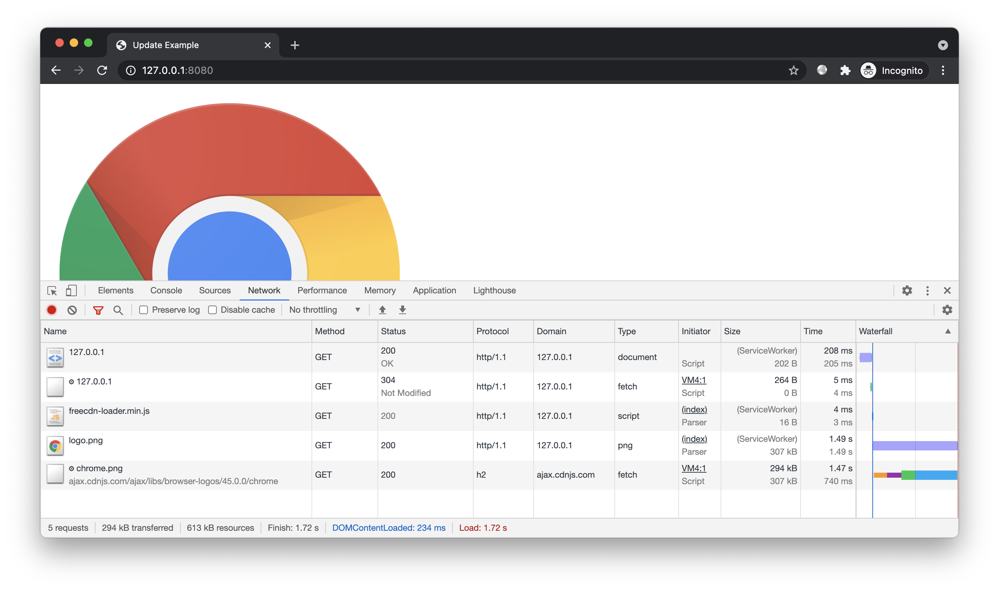
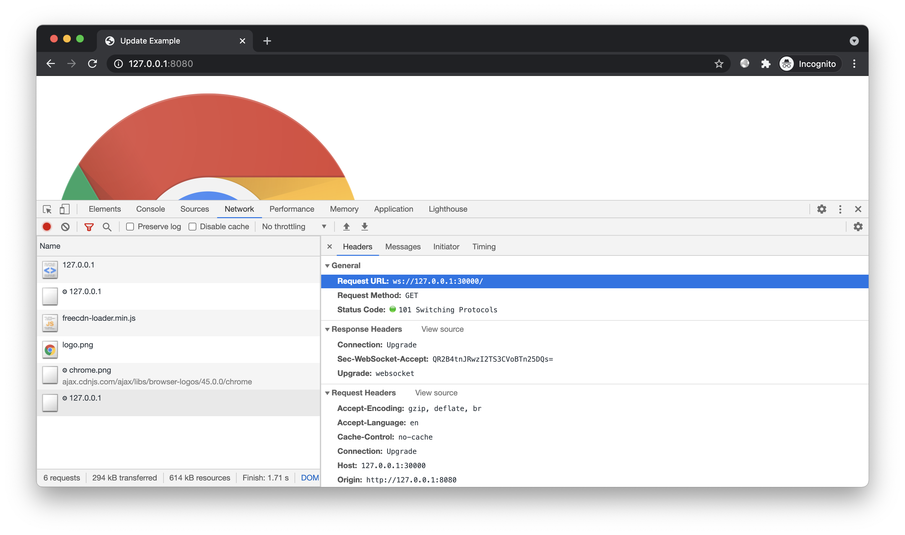
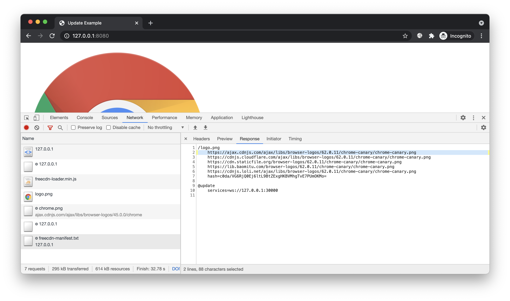
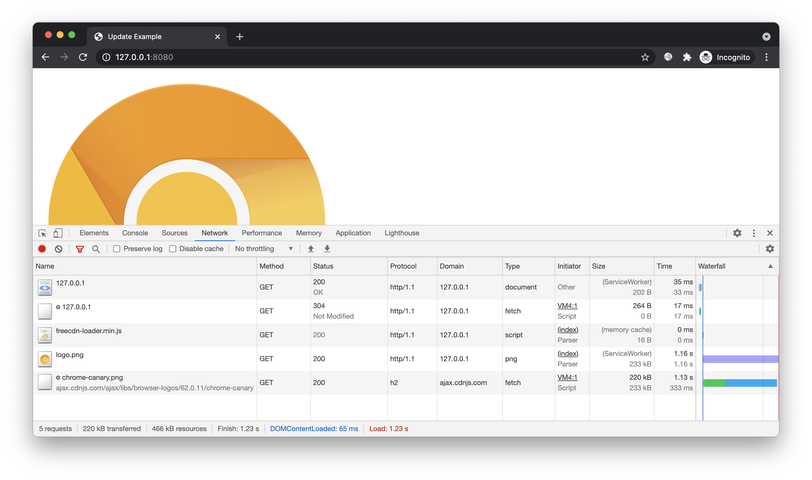

# 简介

演示清单快速更新的效果。


# 预备

进入本案例 `www` 目录。本案例已提供清单文件，只需创建前端脚本：

```bash
freecdn js --make
```

开启 HTTP 服务：



不断刷新页面，可见程序并没有重新加载清单文件。难道清单不会自动更新？

事实上 freecdn 不会因为刷新页面而重新加载清单，而是每隔 300s 加载一次。这对于更新频繁的场合似乎有些落后。尽管可配置更短的间隔，但更高的检测频率会带来更多请求，消耗网站更多流量。

如果有个服务能在清单变化时通知前端，这样不仅无需频繁检测，还能第一时间更新，效率大幅提升。本案例我们讲解如何实现这样的效果。


# 开始

## 后端服务

安装 freecdn 更新推送服务：

```bash
npm install freecdn-update-svc -g
```

启动服务：

```bash
freecdn-update-svc --timer 10
```

该服务默认使用 30000 端口。出于演示，这里每隔 10s 检测一次清单文件（默认 60s）。

## 前端配置

新建 [配置文件](custom.conf)：

```bash
@update
	services=ws://127.0.0.1:30000
```

合并配置到当前清单：

```bash
freecdn manifest --merge ../custom.conf
```

## 效果预览

新建隐身窗口：



前端通过 WebSocket 和更新服务保持连接；更新服务显示有新用户加入，并开始对源站点的清单文件进行定期检测。

我们修改 `freecdn-manifest.txt` 模拟清单更新，例如将 `/logo.png` 的配置修改成如下内容：

```bash
/logo.png
	https://ajax.cdnjs.com/ajax/libs/browser-logos/62.0.11/chrome-canary/chrome-canary.png
	https://cdnjs.cloudflare.com/ajax/libs/browser-logos/62.0.11/chrome-canary/chrome-canary.png
	https://cdn.staticfile.org/browser-logos/62.0.11/chrome-canary/chrome-canary.png
	https://lib.baomitu.com/browser-logos/62.0.11/chrome-canary/chrome-canary.png
	https://cdnjs.loli.net/ajax/libs/browser-logos/62.0.11/chrome-canary/chrome-canary.png
	hash=c0da/VG6RjQ0Ej6ltL9BtZExgHKBVMhgTvE7PUmOKMo=
```

几秒钟后，更新服务检测到站点清单文件发生变化，通知所有在线用户。前端收到推送消息后，重新加载清单文件，得到最新的清单内容：



刷新页面，图片变成最新版本：



注意，freecdn 默认为所有资源设置了 30s 内存缓存，因此刷新后可能不会立即生效，需要稍等一会再刷新。（日志显示 `memory cache` 说明资源直接从内存缓存加载，过期后才会请求 `ServiceWorker`）

## 备用服务

如果觉得单个更新服务不够稳定，你可以设置多个，使用空白字符分隔：

```bash
@update
	services=url1 url2 ...
```

如果觉得搭建更新服务有些麻烦，你可以使用本项目的公共服务：

```bash
@update
	services=wss://freecdn1.etherdream.com:30000 wss://freecdn2.etherdream.com:30000
```

该服务的协议非常简单，你可以 [参考案例](https://github.com/EtherDream/freecdn-update-svc) 自己实现一个更新服务。

## 轮询更新

如果你的站点不经常更新，那就没必要配置推送服务了，使用内置的轮询更新即可。

程序默认每隔 300s 检测清单文件是否有变化，你也可以调整轮询间隔：

```bash
@update
	interval=100s
```


# 结尾

掌握本文案例后，你可以在不改变业务逻辑的前提下，快速修改某个静态资源的内容，而不用 PURGE CDN 缓存、等待用户端缓存失效，非常适合紧急修复。

传统更改 URL 的方案，可能需要更新多个资源。例如为了修复有问题的图片文件，导致引用它的 CSS 文件也得修改（因为图片重新发布后 URL 变了），而引用了 CSS 文件的 JS 也得修改（因为 CSS 的 URL 也变了），引用了 JS 文件的 HTML 也得修改。。。一个文件的变化导致整个依赖链都得更新，浪费不必要的流量。