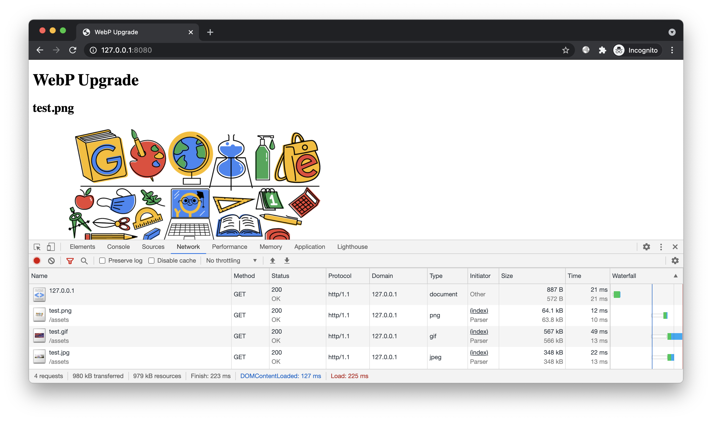
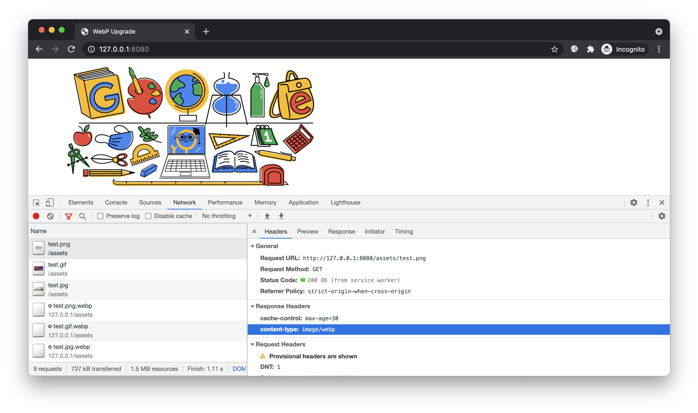

# 简介

演示 freecdn 自动将图片切换到 WebP 版本。


# 预备

进入本案例 `www` 目录，开启 HTTP 服务：



该页面引用了 PNG、GIF、JPG 图片。本案例我们演示如何在不修改后端服务的前提下，自动将图片升级到 WebP 格式。

# 开始

## 格式转换

安装 WebP 转换工具，可从 [官网下载](https://developers.google.com/speed/webp/docs/using)。

转换 test.png：

```bash
cwebp assets/test.png \
  -o assets/test.png.webp \
  -lossless \
  -z 9 \
  -m 6
```

转换 test.gif：

```bash
gif2webp assets/test.gif \
  -o assets/test.gif.webp \
  -min_size
```

转换 test.jpg（质量 100）：

```bash
cwebp assets/test.jpg \
  -o assets/test.jpg.webp \
  -q 100 \
  -z 9 \
  -m 6
```

文件大小对比：

```text
566,362  test.gif
493,942  test.gif.webp
348,061  test.jpg
196,862  test.jpg.webp
 63,767  test.png
 44,504  test.png.webp
```

实际应用中，可通过脚本自动为站点下所有图片生成相应的 WebP 文件。

## 生成清单

搜索文件，保存清单：

```bash
freecdn find --save
```

虽然当前站点下没有公共文件，但工具发现图片文件存在相应的 .webp 后缀时会将其加入清单，用于标记该文件可升级。

这次的清单内容很简单，只有原文件名，没有备用 URL 和参数：

```
/assets/test.png.webp

/assets/test.gif.webp

/assets/test.jpg.webp
```

当然，如果 WebP 文件能在数据库中找到的话，工具还是会带上备用 URL 和相应参数的。

## 接入脚本

创建前端脚本：

```bash
freecdn js --make
```

在 `index.html` 头部引入：

```html
<script src="/freecdn-loader.min.js"></script>
```

## 效果预览

再次访问，这些图片都被代理到 WebP 版本：



虽然原图片 URL 并没有变化，扩展名仍是 PNG/GIF/JPG，但收到的 `content-type` 响应头是 `image/webp`，因此浏览器使用 WebP 格式解码。

## 其他格式

除了 WebP 格式，freecdn 还支持 AVIF 格式自动升级，实现方式和上述相同。具体可参考 [图片升级文档](../../docs/img-upgrade/)。


# 结尾

掌握本文案例后，你既不用修改前端业务代码，也不用修改后端服务配置，以最低的成本开启 WebP 无缝切换。